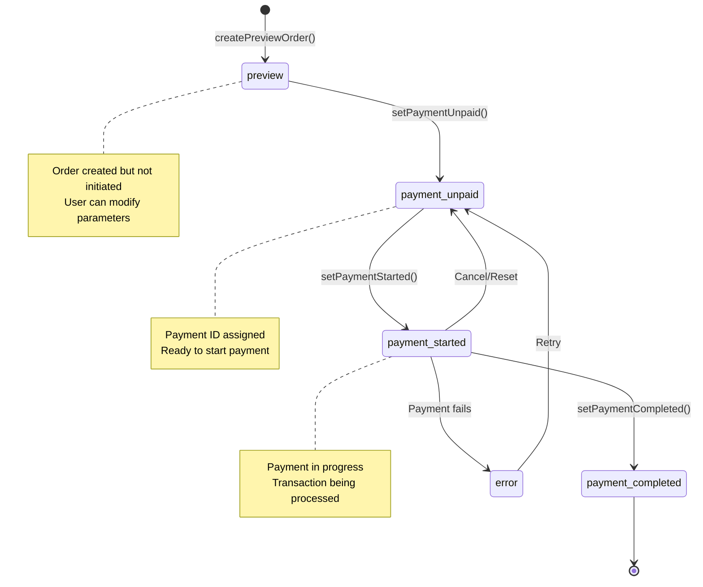
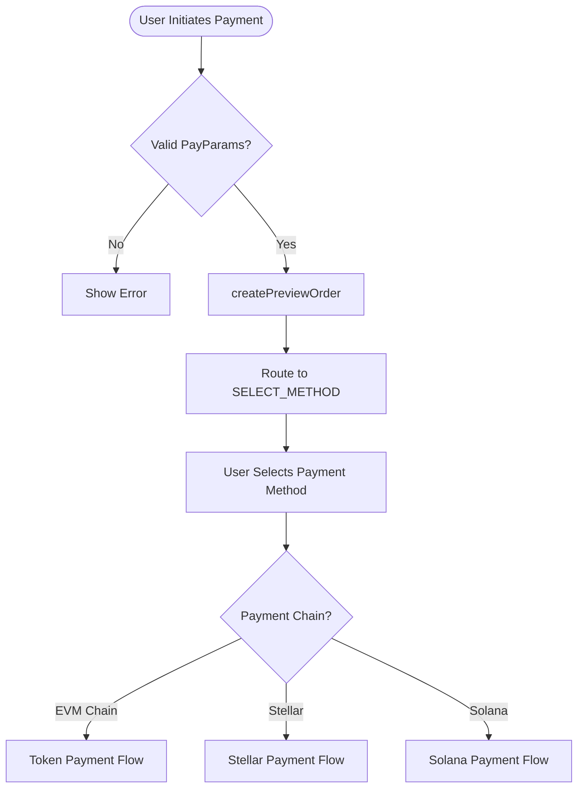
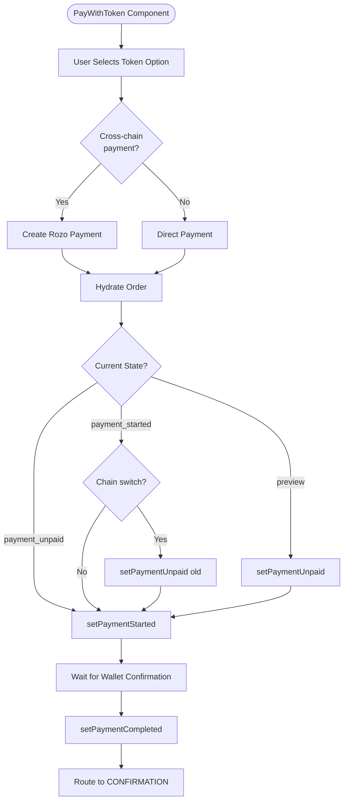
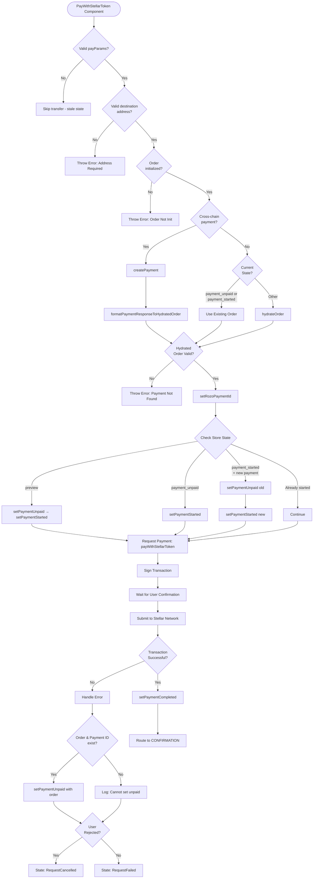
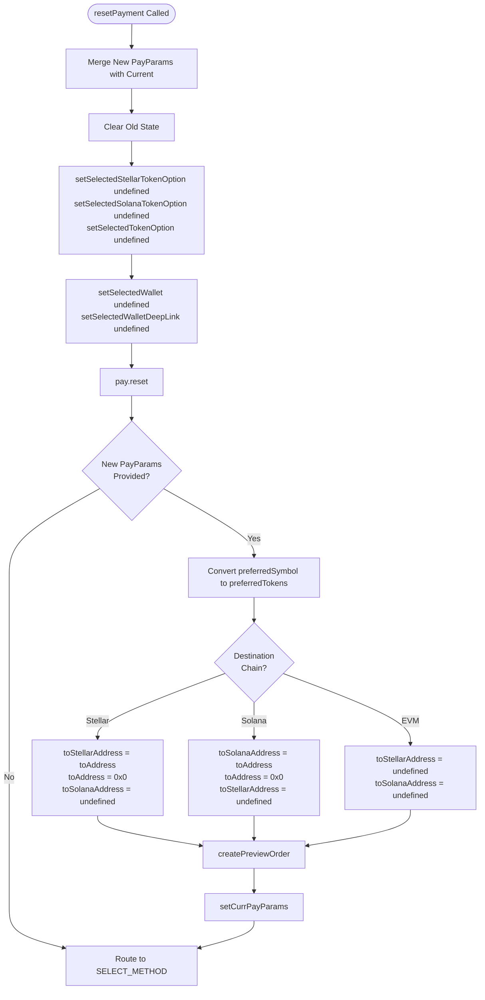
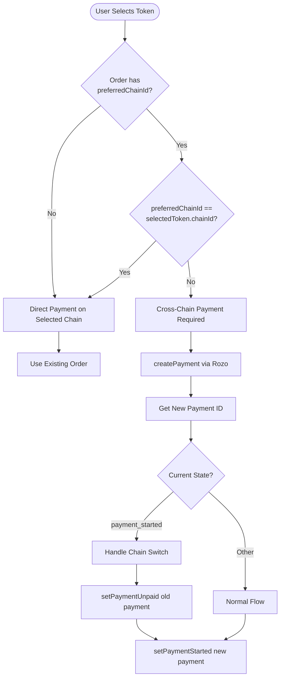

# Payment Flow Documentation

## Overview

This document describes the payment flow architecture in the ConnectKit payment system, including state management, payment methods, and cross-chain payment handling.

---

## Payment States

The system manages payment state through a centralized state machine:



---

## Main Payment Flow

### 1. Initial Setup



### 2. Token Payment Flow (EVM Chains)



### 3. Stellar Payment Flow



### 4. Solana Payment Flow

The Solana payment flow is identical to the Stellar flow, with these differences:
- Uses `PayWithSolanaToken` component
- Uses `payWithSolanaToken` instead of `payWithStellarToken`
- Validates Solana addresses instead of Stellar addresses
- Submits to Solana network instead of Stellar

---

## Reset Payment Flow



---

## State Transition Rules

### From Preview State
- Can transition to: `payment_unpaid`
- Requires: Order data
- Action: `setPaymentUnpaid(paymentId, order)`

### From Payment Unpaid State
- Can transition to: `payment_started`
- Requires: Payment ID and order
- Action: `setPaymentStarted(paymentId, hydratedOrder)`

### From Payment Started State
- Can transition to:
  - `payment_completed` (success)
  - `payment_unpaid` (cancel/reset)
  - `error` (failure)
- Special case: Cross-chain switch requires transition to `payment_unpaid` first

### From Error State
- Cannot call `setPaymentUnpaid` without providing order
- Must provide both `paymentId` and `order` parameters

---

## Cross-Chain Payment Handling



---

## Key Components

### usePaymentState Hook
- **Location**: `packages/connectkit/src/hooks/usePaymentState.ts`
- **Responsibilities**:
  - Manages `currPayParams` state
  - Handles `resetOrder` logic
  - Clears selected options on reset
  - Routes to appropriate payment flow

### useStellarDestination Hook
- **Location**: `packages/connectkit/src/hooks/useStellarDestination.ts`
- **Responsibilities**:
  - Derives destination address from `payParams`
  - Determines payment direction (Stellar → Base, Base → Stellar, etc.)
  - Returns memoized values based on `payParams`

### Payment Components
1. **PayWithToken** - EVM chain payments
2. **PayWithStellarToken** - Stellar network payments
3. **PayWithSolanaToken** - Solana network payments

---

## Common Issues & Solutions

### Issue: Stale Destination Address After Reset

**Symptom**: After `resetPayment`, component uses old destination address from previous payment attempt.

**Root Cause**:
- `destinationAddress` from `useStellarDestination(payParams)` is memoized
- React batches state updates, so component may not re-render with new `payParams` before `useEffect` triggers

**Solution**:
1. Validate `payParams` exists before processing transfer
2. Add logging to track destination address and chain info
3. Check for stale state and skip processing if detected

```typescript
// Validate we have current payParams - if not, component has stale state
if (!payParams) {
  log?.("[Component] No payParams available, skipping transfer");
  setIsLoading(false);
  return;
}
```

### Issue: setPaymentUnpaid Error When State is "error"

**Symptom**: `Error: Cannot set payment unpaid: Order must be provided when state is error`

**Root Cause**:
- Error handler calls `setPaymentUnpaid(paymentId)` without order parameter
- When state is "error", order must be provided

**Solution**:
```typescript
if (rozoPaymentId && order && 'org' in order) {
  try {
    await setPaymentUnpaid(rozoPaymentId, order as any);
  } catch (e) {
    console.error("Failed to set payment unpaid:", e);
  }
} else {
  log?.(`Cannot set payment unpaid - missing requirements`);
}
```

---

## Payment State Validation

### Required Checks Before Payment
1. ✅ `payParams` exists and is current
2. ✅ `destinationAddress` is valid for target chain
3. ✅ `order` is initialized
4. ✅ Selected token option matches payment parameters
5. ✅ Wallet is connected (for blockchain payments)

### State Transition Validation
1. ✅ Cannot go from `error` to `payment_unpaid` without order
2. ✅ Cannot go from `preview` to `payment_started` without going through `payment_unpaid`
3. ✅ Cross-chain switch requires resetting old payment before starting new one

---

## Debugging Tips

### Enable Logging
Look for log statements in the components:
```typescript
log?.(`[PayWithStellarToken] Payment setup - destAddress: ${finalDestAddress}, toChain: ${payParams.toChain}, token chain: ${option.required.token.chainId}`);
```

### Check State Transitions
Monitor the payment state in Redux DevTools or logs:
```typescript
const currentState = store.getState().type;
console.log('Current payment state:', currentState);
```

### Validate payParams
Check if `payParams` are being updated correctly:
```typescript
console.log('payParams:', JSON.stringify(payParams, null, 2));
```

### Check Destination Address
Verify destination address derivation:
```typescript
const { destinationAddress } = useStellarDestination(payParams);
console.log('Destination:', destinationAddress);
console.log('ToChain:', payParams?.toChain);
console.log('ToStellarAddress:', payParams?.toStellarAddress);
```
